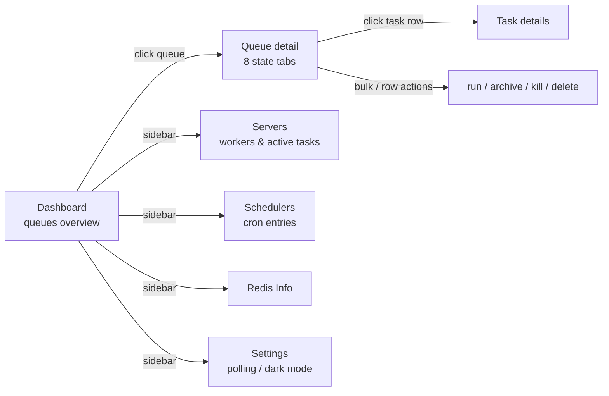

# Asynqmon User Manual (EN)

> Asynqmon is the monitoring & administration Web UI for the [Asynq](https://github.com/austinyuch/asynq) task queue (team fork: `github.com/austinyuch/asynqmon`).
> Every screenshot below is **live evidence**: real Valkey 9.1 + a real asynq worker/scheduler + the canonical demo scenario (`docs/manual/demo/main.go`).
> Product-level readiness: **PASS** (authority: `.agents/specs/003-*/review.md`, `004-*/review.md` + the 12/12 browser smoke). Regeneration: [`docs/MANUAL_GENERATION_GUIDE.md`](../../MANUAL_GENERATION_GUIDE.md).

Default evidence metadata for all screenshots (deviations noted per section):
**Evidence Source** = live screenshot (seeded demo) · **Coverage Tier** = full-integration · **Readiness State** = PASS (review.md)

## Audience quick paths

| You are | Start with |
|---|---|
| Ops / on-call (queue health, firefighting) | Dashboard → Task states → Retry & Archived |
| Backend developer (embed in your service, inspect tasks) | Getting Started (library mode) → Task details |
| Platform admin (worker capacity, cron) | Servers → Schedulers → Queue actions |

## Getting Started / Starter assets

Three ways to run (pick one):

```bash
# 1) standalone binary
asynqmon --port=8080 --redis-addr=localhost:6379

# 2) container (local publish rules: .agents/skills/local-image-publish-governance/)
podman run --rm -p 8080:8080 localhost/local/asynqmon --redis-addr=host.containers.internal:6379

# 3) Go library embed (primary consumption mode; the UI bundle is go:embed'ed)
h := asynqmon.New(asynqmon.Options{
    RootPath:     "/monitoring",
    RedisConnOpt: asynq.RedisClientOpt{Addr: "localhost:6379"},
})
mux.Handle(h.RootPath()+"/", h)
```

Starter assets (git-tracked, directly downloadable/runnable):

| File | Purpose |
|---|---|
| [`demo/main.go`](../demo/main.go) | One-shot seeding of **every task state** + a live worker/scheduler (real asynq API) |
| [`../../ui/e2e/manual-screenshots.spec.ts`](../../../ui/e2e/manual-screenshots.spec.ts) | Screenshot/VRT spec — a starting point for your own E2E |

## UX Flow



## Dashboard


*Stacked per-state queue sizes, 7-day processed/failed trend, queue table (state/size/latency/error rate). Note the `low` queue shown in red as **paused**. The Actions menu (⋯) offers pause/resume/delete.*


*Dark mode (Settings → Dark Theme → Always).*

## Task states (the 8 tabs of a queue)

| State | Meaning | Demo sample |
|---|---|---|
| Active | being processed by a worker | `video:transcode` (25-min long task) |
| Pending | waiting for dispatch | `image:resize` ×5 (held because the queue is paused) |
| Aggregating | waiting in a group | `metrics:event` ×5 (group `metrics-batch`) |
| Scheduled | future ProcessIn/ProcessAt | `report:generate` ×5 (+2h) |
| Retry | failed, will retry | `sync:export` (S3 unreachable, MaxRetry 10) |
| Archived | retries exhausted / manually archived | `billing:charge` (MaxRetry 0), `image:resize` ×2 (Inspector) |
| Completed | succeeded, within Retention | `email:welcome/digest` ×14 |


*Active tab: payload and elapsed time; cancellable unless READ_ONLY.*


*Pending tab on a paused queue: tasks stay queued; the paused badge is visible next to the queue name.*


*Scheduled tab: Process-In countdown; Run now / Archive / Delete per row or in bulk.*


*Retry tab: last error message (demo: "upstream S3 bucket unreachable"), retry count/limit, next retry time.*


*Archived tab: the archival reason (card declined) is kept in Last Error; Run / Delete available.*


*Completed tab: successful tasks within Retention, with completion time.*


*Aggregating tab: the group selector (top-left, `metrics-batch`) switches groups; tasks wait for GroupGracePeriod/MaxSize.*

## Task details


*Click any task row: full payload (JSON highlighted), queue, state, retry counters, Last Error, next retry; breadcrumbs lead back to the queue.*

## Servers (workers)


*One row per asynq server (host:PID, uptime, queue weights critical 6 / default 3 / low 1). Expanding the row reveals **Active Workers** — the live `video:transcode` task with its payload, actually running in the demo worker.*

## Schedulers (cron entries)


*Two entries registered by the demo scheduler: `*/5 * * * *` report:generate (critical) and `@every 1h` cleanup:tmp (low); next/prev enqueue times and history included.*

## Redis Info


*INFO summary of the connected Valkey/Redis (version, memory, connections, …).*

## Settings


*Polling interval (default 8s) and Dark Theme preference (System Default / Always / Never).*


## Metrics (known gap)


*⚠️ **Evidence Source** = live screenshot (graceful empty state) · **Coverage Tier** = `not_assessed` · **Readiness State** = `not_assessed` · Code: `DEMO_NOT_ASSESSED` (ISSUE_LOG IL-004). This page requires the server to run with `--enable-metrics-exporter` and a Prometheus at `--prometheus-addr`; the demo has no Prometheus, so this only proves graceful rendering — not the charting feature.*

## CLI flags quick reference (server deployment)

| Flag / Env | Description |
|---|---|
| `--port` / `PORT` | listen port (default 8080) |
| `--redis-addr` / `REDIS_ADDR` | Redis/Valkey address |
| `--redis-url` / `REDIS_URL` | redis:// or redis-sentinel:// URI (sentinel password semantics fixed in this fork) |
| `--redis-cluster-nodes` | cluster node list |
| `--read-only` | read-only UI (hides all mutating actions) |
| `--enable-metrics-exporter` + `--prometheus-addr` | enables the Metrics page |

Full list: `asynqmon --help` (Go flag convention — exits with code 2).
